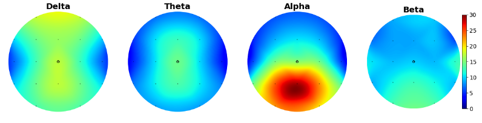
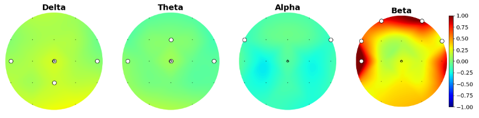
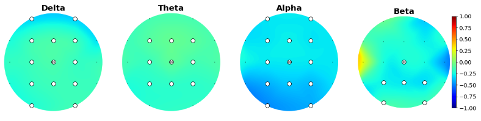
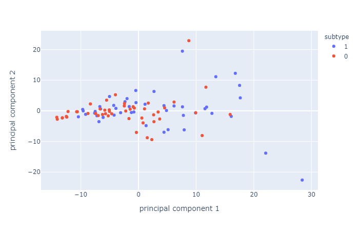
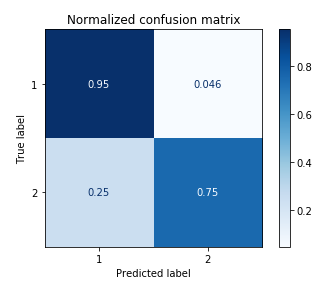

# ADHDsubtypes_project

This project was conducted for BrainHack school 2020 by Béatrice De Koninck & Pénélope Pelland-Goulet.

## Background

Attention deficit/hyperactivity disorder (ADHD) is one of the most common neurodevelopmental disorders among children and adolescents. It manifests itself through a variety of cognitive and behavioral symptoms, such as (but not limited to) hyperactivity, lack attention, impulsivity, lack of inhibition and diminished working memory. Long-term follow-up studies revealed that in 40 to 60% of children with ADHD, the disorder persists into adulthood ([American Psychiatric Association, 2012](https://psycnet.apa.org/fulltext/2011-28648-001.html); [Hechtman, L., 1999](https://onlinelibrary.wiley.com/doi/10.1002/(SICI)1098-2779(1999)5:3%3C243::AID-MRDD11%3E3.0.CO;2-D); [Klein, RG et al. 2012](https://pubmed.ncbi.nlm.nih.gov/23070149/)). Subtype classification of ADHD has not reach consensus whithin the litterature and research on the correlates of ADHD subtypes show incoherent findings. The most common grouping of adhd subtypes (which is also the DSM categorization) are (1) inattentive, (2) impulsive/Hyperactive and (3) mixed. Those subtypes are for the majority based on criteria derived from behavioral and-self-report data and lack of neurophysiological assessment is prominent([Hegerl et al. 2016](https://pubmed.ncbi.nlm.nih.gov/27178310/); [Olbrich, Dinteren & Arns, 2015](https://pubmed.ncbi.nlm.nih.gov/26901357/)).

## Project definition

This project will aim to investigate the detection of subtypes of ADHD from the possible associations between different types of measurements, pairing common behavioral and self-reporting measures to electrophysiological (EEG) data. More specifically, Principal components analysis (PCA) will be applied in order to achieve dimension reduction and k-nearest neighbor clustering will be used to predict the DSM ADHD subtypes. In addition, an investigation of the predictive capacity of our 3 data types will be made, as well as observations about the potential prediction of gender using our dataset.

As well as learning all the tools and analysis that are listed at the bottom of this README, one of our goals to create notebooks that can be easily understood and modified by people with little coding experience. In order to do this, we included very specific instructions and comments in our notebooks, educating the viewer on the code, the functions, the plots, and the results.

## Data

The sample consisted of 96 college students with an ADHD condition. Different types of measurements are included in this data sample. EEG data recording was performed using a 19-channel electrode cap (international 10-20 system) and consisted of eyes-opened at-rest recording of 5-minute duration. Time-frequency analyses were conducted for each electrode in order to extract amplitude means for each frequency band. Neuropsychological assessment measures included were Conners questionnaire (self-report) and IVA-II behavioral test.
For classification comparison, ADHD subtypes identified by the Conners questionnaire are used. Those subtypes are hyperactive, inattentive and mixed, as described by the DSM-IV. More information about EEG preprocessing can be found [here](https://github.com/brainhack-school2020/SNF_ADHDsubtypes_project/blob/master/eeg_preprocessing.md).

## Methods

Participants : women (n = 57), men (n = 39)
Adhd subtype : hyperactive (n = 2), inattentive (n = 48), mixed (n = 46)

* Conners questionnaire : standardized questionnaire. Comprizes 66 items about ADHD symptoms and behaviors. Answers are given using a Likert scale (0 = not at all/never and 3 = very often/very frequent). The items are compiled into 4 scales;

   * inattention/memory (IM)
   * hyperactivity/restlessness (HR)
   * impulsivity/emotional lability (IE)
   * problems with self concept (SC) (refers to self esteem).

These four scores are used as the 4 self report symptoms measures. Test-retest correlation for 18-29 years old ranges from 0,8 to 0,92 depending on items.      

* IVA-II : Behavioral test. Participants are presented with visual and auditive stimuli (numbers). If the stimulus is 1, whether it is visual or auditive, subjects must click as quickly as possible. If the stimulus is 2, whether it is visual or auditive, subjects must refrain from clickling. Stimuli are presented in a randomized order and at random time. 2 main scales are extracted, comprising 2 subscales each. 1st main scale is Attention Quotient (AQ) and its subscales are AQ auditive and AQ visual. 2nd main scale is Response Control Quotient (RCQ) and its subscales are RCQ auditive and RCQ visual.

*  Electroencephalography (EEG) : 19 electrodes caps were used, positioned according to the 10-20 international system and referenced to both ear lobes. Recordings lasted 5 minutes, were participants were instructed to be as still as possible and to keep their eyes opened. The Mitsar System 201 and WinEEG (Mitast) softwares were used for recording. Test-retest and split-half correlations were higher than 0,9.

Data description and visualization was done in the [Viz.ipynb](https://github.com/brainhack-school2020/SNF_ADHDsubtypes_project/blob/master/Viz.ipynb) file. 

Then, eeg scalp plots were created in the [Scalp_Plots.ipynb](https://github.com/brainhack-school2020/SNF_ADHDsubtypes_project/blob/master/Scalp_Plots.ipynb), where statistical tests were also computed on eeg data.

Finally, the main analysis can be found in the [main_analyses.ipynb](https://github.com/brainhack-school2020/SNF_ADHDsubtypes_project/blob/master/main_analyses.ipynb) file. They consist of Principal Component Analysis, a dimension reduction technique that was applied to the 3 types of data in order to extract possible pertinent features that were later used in the classification of ADHD subtypes and gender. Classification was made using a k-nearest neighbors method, with and without PCA, in order to investigate the effect of PCAs on classification of gender and ADHD.

## Results

We were interested in gender differences and ADHD subtype differences, so we started by plotting their scalp distribution. White electrodes indicate the significant differences (computed via Mann-Whitney non parametric test and corrected with Bonferroni).

Here is the scalp plot showing gender differences. 

And here are the scalp plots showing subtype differences.

PCA analysis and KNN classification yielded interesting results. First, we compared the performance of a k-nearest neighbors clasification using PCA as features versus using the data without dimension reduction. Here are the results:
First, we tried to predict ADHD subtype (inattentive vs combined) using eeg data, separating pools of electrodes. None of the classifications were statistically higher than chance level (50%).

| Electrode pool  | Knn result using PCA       | Knn result without PCA     |
| :--------------:|:--------------------------:| :-------------------------:|
| Central         | Acccuracy = 47%, p = 0.26  | Accuracy: 52.6%, p = 0.3   |
| Temporal        | Accuracy = 36%, p = 0.54   | Accuracy = 42.1%, p = 0.16 |
| Occipital       | Accuracy = 47.4%, p = 0.861| Accuracy = 52.6%, p = 0.624|
| Frontal         | Accuracy = 36.84%, p = 0.74| Accuracy = 26.3%, p = 0.89 |
| Parietal        | Accuracy = 52.6%, p = 0.94 | Accuracy = 36.8%, p = 0.396|

These results might not be surprising, considering PCA resulted in very similar principal components which are hard to distinguish, for all electrode pools.

Second, we tried to predict ADHD subtype again, this time using Conners scale (cognitive data) and IVA-II (behavioral data) separately, with and without PCA. Conners scale could predict ADHD subtype with a precision of 73,68%, with or without PCA. IVA-II classificaiton was not significally higher than chance level (50%).

| Feature       | Knn result using PCA         | Knn result without PCA     |
| :------------:|:----------------------------:| :-------------------------:|
| Conners Scale | Acccuracy = 73.68%, p = 0.009| Accuracy: 73.68%, p = 0.019|
| IVA-II        | Accuracy = 52.6%, p = 0.67   | Accuracy = 52.6%, p = 0.76 |

Finally, we also tried predicting gender according to Eeg distribution. This classification yielded the best results, with and without PCA.

| Feature| Knn result using PCA         | Knn result without PCA     |
| :-----:|:----------------------------:| :-------------------------:|
| EEG    | Acccuracy = 87.4%, p = 0.009 | Accuracy: 85.79%, p = 0.009|

Here is the confusion matrix for the classification of gender (using PCA):

## The tools we learned through this project

 * Git and GitHub
 * Bash shell
 * Ubuntu
 * Jupyter Notebook/Jupyter Slides
 * Python packages : pandas, SNFpy, scikit-learn, numpy, scipy, etc.
 * Visualization packages (via python): seaborn, plotly, matplotlib, hytools, etc. 

## Deliverables

At the end of this project, we will have:

 - A Jupyter notebook markdown describing thoroughly all the steps of our project 
 - Python script of main analyses 
 - Complete published repository access to all commits and changes of our projects
 - An interactive platform to present the different data and analysis

### Week 3 deliverable: data visualization

This [deliverable](https://github.com/brainhack-school2020/SNF_ADHDsubtypes_project/blob/master/Interactive_plots_deliverable.ipynb) was done entirely as a team. Penelope developed the visualization for Conners (cognitive data) and IVA-II (behavioral data) (interactive plots of distribution for each data type), and Beatrice developed the script for eeg data visualization (interactive plot with facets of spectral power distribution as well as an example of 2D visualization of PCA). Scalp plots were created jointly.

Please make sure to see the	[requirements_week3deliverable.txt](https://github.com/brainhack-school2020/SNF_ADHDsubtypes_project/blob/master/requirements_week3deliverable.txt), to pull [Data](https://github.com/brainhack-school2020/SNF_ADHDsubtypes_project/tree/master/Data) file (with all the necessary files) and follow instruction in the notebook (linked). The excel_files folder has to be moved from the Data folder to the same directory as the notebook, in order for the path to stay the same. 

Files created for this deliverable were donc with this [pre_processing_analysis.ipynb](https://github.com/brainhack-school2020/SNF_ADHDsubtypes_project/blob/master/pre_preprocess_analysis.ipynb) 

## Progress overview

* As of may 26 2020; the data has been preprocessed and organized into pandas dataframes. 
* As of may 29 2020; the jupyter notebook for data visualization is well advanced; and we are working on our SNF.
* As of june 1st; we decided to let go of our SNF analysis and concentrate our efforts on clustering, PCA and visualization,    as it seems far more appropriate to our data.
* As of june 8th; we have completed our data analysis and data visualization, what is left to do before final submission is some reorganisation of our repository and simplification of our code.

## Submission week : 

**Deliverables** :

* [main_analyses.ipynb](https://github.com/brainhack-school2020/SNF_ADHDsubtypes_project/blob/master/main_analyses.ipynb): jupyter notebook of all data wrangling, some interactive data visualization, and complete PCAs, KNN analyses (with comparisons of KNN without PCAs) on all 3 types of data
* [Visualization.ipynb](https://github.com/brainhack-school2020/SNF_ADHDsubtypes_project/blob/master/Viz.ipynb) : jupyter notebook of all the visualisation made for all 3 datasets, plus topography maps and a section with topography maps with significance masks for electrode comparisons. 
* [Scalp_Plots.ipynb](https://github.com/brainhack-school2020/SNF_ADHDsubtypes_project/blob/master/Scalp_Plots.ipynb) : jupyter notebook for scalp plots visualization and stastitical analysis
* [preprocessing.py](https://github.com/brainhack-school2020/SNF_ADHDsubtypes_project/blob/master/preprocessing.py) : File with all functions needed to run all the notebooks created
* [requirement.txt](https://github.com/brainhack-school2020/SNF_ADHDsubtypes_project/blob/master/requirement.txt) : libraries required for this project

 

