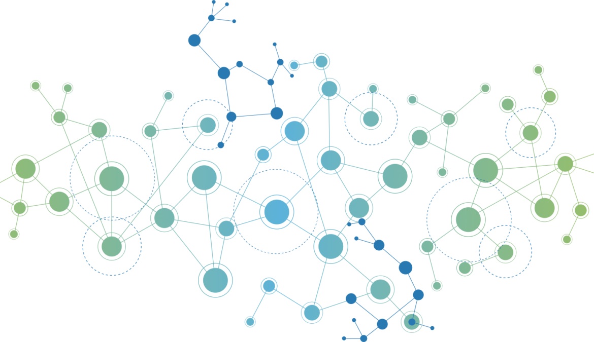

# SNF_ADHDsubtypes_project

This project will be conducted for BrainHack school 2020

## Background

Attention deficit/hyperactivity disorder (ADHD) is one of the most common neurodevelopmental disorders among children and adolescents. It manifests itself through a variety of cognitive and behavioral symptoms, such as (but not limited to) hyperactivity, lack attention, impulsivity, lack of inhibition and diminished working memory. Subtype classification of ADHD has not reach consensus whithin the litterature and research on the correlates of ADHD subtypes show incoherent findings. The most common grouping of adhd subtypes (which is also the DSM categorization) are (1) inattentive, (2) impulsive/Hyperactive and (3) mixed. Those subtypes are for the majority based on criteria derived from behavioral and-self-report data and lack of neurophysiological assessment is prominent([Hegerl et al. 2016](https://pubmed.ncbi.nlm.nih.gov/27178310/); [Olbrich, Dinteren & Arns, 2015](https://pubmed.ncbi.nlm.nih.gov/26901357/)).

## Project definition

This project will aim to investigate the presence of subtypes of ADHD from the possible associations between different types of measurements, pairing common behavioral and self-reporting measures to electrophysiological (EEG) data, as well as exploring complementary attributes. To do so, a Similarity Network Fusion (SNF) will be used to integrate these different types of data in a non-linear fashion, guided by the tutorial from Ross Markello. SNF permits the construction of similarity networks of samples (ADHD participants) for each data type, which are then iteratively integrated into in one novel network ([Wang et al., 2014](https://pubmed.ncbi.nlm.nih.gov/24464287/)). Integrating data with this method allows the exploration of common and complementary information between these different types of data. 

## Data

The sample consisted of 97 college students with an ADHD condition. Different types of measurements are included in this data sample. EEG data recording was performed using a 19-channel electrode cap (international 10-20 system) and consisted of eyes-opened at-rest recording of 5-minute duration. Time-frequency analyses were conducted for each electrode in order to extract amplitude means for each frequency band. Neuropsychological assessment measures included were Conners questionnaire (self-report) and IVA-II behavioral test.

## Methods

ID: participants ID

Age: participants age

Gender: women = 1, men = 2

Conners questionnaire : standardized questionnaire. Comprizes 66 items about ADHD symptoms and behaviors. Answers are given using a Likert scale (0 = not at all/never and 3 = very often/very frequent). The items are compiled into 4 scales;

   * inattention/memory (IM)
   * hyperactivity/restlessness (HR)
   * impulsivity/emotional lability (IE)
   * problems with self concept (SC) (refers to self esteem) These four scores are used as the 4 self report symptoms     measures. Test-retest correlation for 18-29 years old ranges from 0,8 to 0,92 depending on items.      

IVA-II : Behavioral test. Participants are presented with visual and auditive stimuli (numbers). If the stimulus is 1, whether it is visual or auditive, subjects must click as quickly as possible. If the stimulus is 2, whether it is visual or auditive, subjects must refrain from clickling. Stimuli are presented in a randomized order and at random time. 2 main scales are extracted, comprising 2 subscales each. 1st main scale is Attention Quotient (AQ) and its subscales are AQ auditive and AQ visual. 2nd main scale is Response Control Quotient (RCQ) and its subscales are RCQ auditive and RCQ visual.

Electroencephalography : 19 electrodes caps were used, positioned according to the 10-20 international system and referenced to both ear lobes. Recordings lasted 5 minutes, were participants were instructed to be as still as possible and to keep their eyes opened. The Mitsar System 201 and WinEEG (Mitast) softwares were used for recording. Test-retest and split-half correlations were higher than 0,9. Need more info on eeg analysis, waiting on a response from my PI.

## Tools

 * Git and GitHub
 * Jupyter Notebook
 * Python : main packages : pandas,MNE-BIDS, SNFpy based on previous [markdown](https://github.com/rmarkello/snfpy)
 * Visualization packages via python
 * MNE
 * Seaborn

## Deliverables

At the end of this project, we will have:

 - A Jupyter notebook markdown describing thoroughly all the steps of our project 
 - Python script of main analyses .
 - OSF project management 
 - Complete published repository access to all commits and changes of our projects
- A blog post describing the project
- An interactive platform to present the different data and analysis

  

## Progress overview

As of may 26 2020; the data has been preprocessed and organized into pandas dataframes. 
As of may 29 2020; the jupyter notebook for data visualization is well advanced; and we are working on our SNF.

## Tools I learned during this project

 * Git and Github
 * Jupyter Notebook
 * Debugging
 
 
 Image source : https://www.pullmanward3.org/issue/publictransportationnetwork/ 
